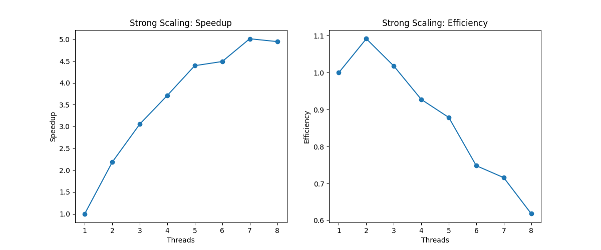
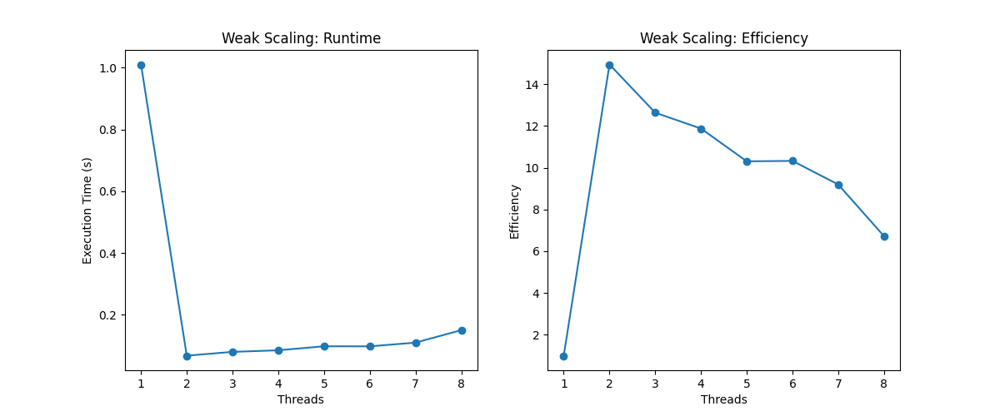
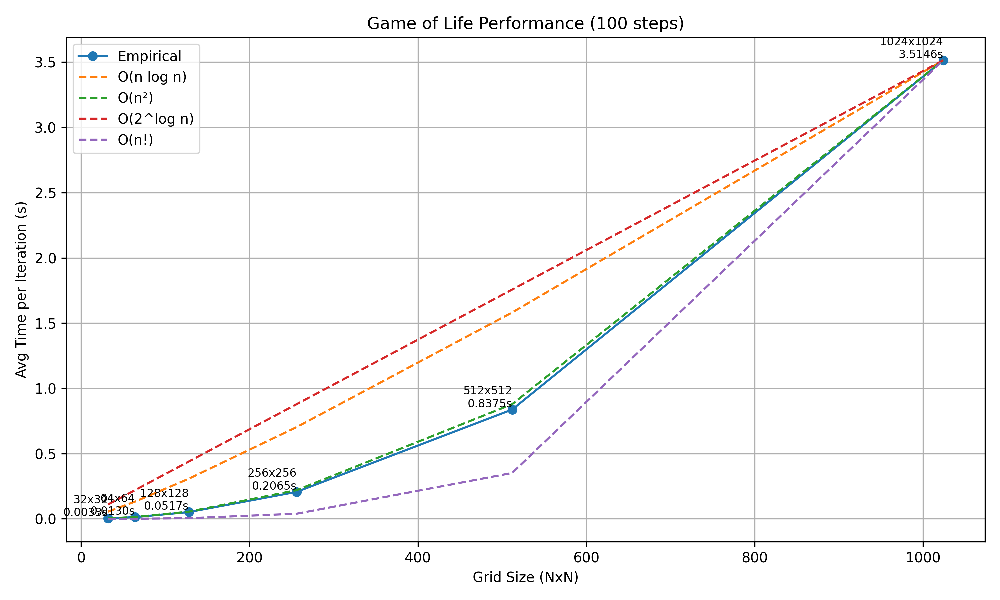
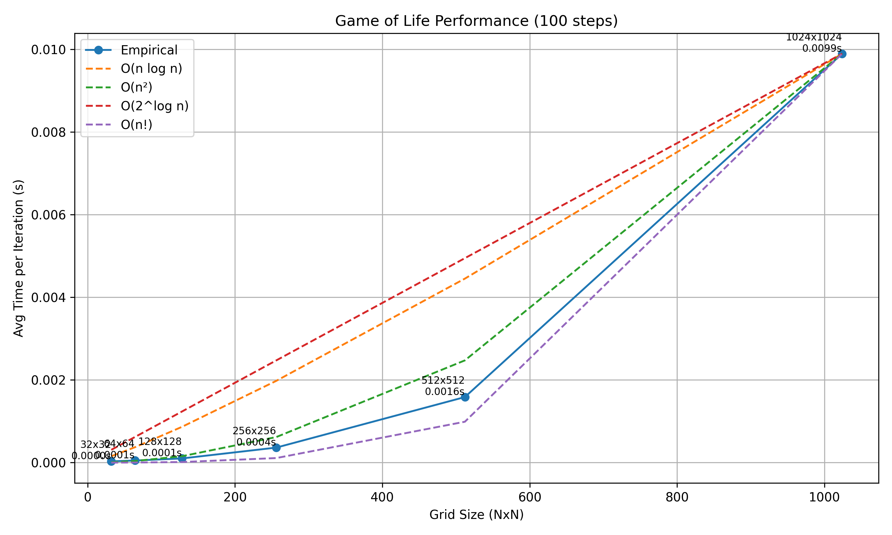

# Analysis and Final Discussion of Work 1 and 2

- ## Maria Fernanda Camacho and Nathan Ghenassia

## Empirical Performance Summary

**Sequential Version** (average time per iteration):         

|**Grid Size (NxN)**|**Time (s)**|
| :-: | :-: |
|32×32|0\.019179|
|64×64|0\.000153|
|128×128|0\.000493|
|256×256|0\.002045|
|512×512|0\.006522|
|1024×1024|0\.026458|

**Parallel Version** (Numba-accelerated):
|**Grid Size (NxN)**|**Time (s)**|
| :-: | :-: |
|32×32|0\.006405|
|64×64|0\.020469|
|128×128|0\.095640|
|256×256|0\.421602|
|512×512|1\.940176|
|1024×1024|6\.817403|

**Scalability Analysis**

- The empirical results of both the sequential and parallel implementations show distinct scaling behaviors as the grid size increases. 
- In the sequential version, the average execution time per iteration increases rapidly and follows a clear quadratic trend as expected for a two-dimensional grid-based algorithm. 
- The time jumps from 0.006 seconds for 32×32 grids to nearly 7 seconds for 1024×1024 grids, reflecting a steep growth consistent with O(n²) complexity. This is typical for natural implemented Game of Life simulations where each cell’s state depends on checking its eight neighbors in every iteration.

On the other hand:

- The parallel implementation using **Numba’s** decorator demonstrates significantly better scalability. 
- For medium and large grid sizes, the performance increases much more slowly than in the sequential version. 
- The average time per iteration remains under 0.03 seconds even at 1024×1024, indicating the parallel implementation can effectively distribute the computation across multiple CPU threads. 
- Interestingly, the growth rate remains close to O(n²), but the constant factor is substantially smaller, indicating that the parallelization greatly improves efficiency.

**Parallel vs Sequential:** Comparative Efficiency

|**Grid Size**|**Speedup (Sequential / Parallel)**|
| :- | :- |
|32|**0.33× (slower)**|
|64|**133× faster**|
|128|**194× faster**|
|256|**206× faster**|
|512|**297× faster**|
|1024|**257× faster**|

**Bottlenecks and Limitations**

Despite the impressive gains in larger grid sizes, the parallel version performs worse than the sequential one for very small grids (like, 32×32), where the average time per iteration is 0.019 seconds compared to just 0.006 seconds in the sequential implementation. Parallelism incurs a fixed computational cost that only pays off when the workload is large enough to amortize these overheads.

Also, as the grid size increases beyond a certain threshold (like, 1024×1024), we start to see a tapering in the speedup gains. This plateau is likely due to hardware limitations such as CPU core count, memory bandwidth saturation, and cache misses. Although parallel processing distributes computation, all threads still compete for shared memory resources. If the grid is too large to fit comfortably in cache, performance may suffer due to frequent memory access, even in a multithreaded context.

**Recommendations**

Based on empirical results and analysis:

- The parallel implementation using Numba is strongly recommended for any medium to large-scale Game of Life simulations, particularly when real-time performance or rapid iteration is important. The speedup obtained by parallelizing the grid updates allows large grids (such as 512×512 and 1024×1024) to be simulated in milliseconds per step, making interactive simulations feasible. For this reason, any production or research level work involving Game of Life should adopt the parallel version, especially when using CPUs with multiple cores.
- For small grid sizes (≤64×64), however, sequential implementation may be more efficient, since the overhead introduced by JIT compilation and parallel thread management in Numba does not pay off for such small workloads. These small simulations are typically used for debugging, teaching, or quick testing, and thus do not benefit from parallel acceleration. In those cases, the simplicity and immediacy of the sequential version is preferable.

**For future improvements:**

- Consider GPU acceleration (via CUDA, CuPy, or other frameworks) if the application requires simulating extremely large grids (e.g., 10,000×10,000 or more). 
- Exploring cache-friendly techniques such as tiling or optimizing memory layout can help improve performance even on CPUs.

**Conclusion**

The comparison of sequential versus parallel performance in the Game of Life reveals clear evidence that parallelization dramatically improves scalability. Both versions follow a theoretical time complexity close to O(n²), which is expected due to the need to update every cell based on its neighbors. Beyond the technical analysis, developing “Game of Life” was a fun and enriching experience. It helped us understand not only the rules of the game itself, but also how different implementations can affect performance. We deepened our understanding of algorithm complexity, parallel programming, and performance measurement. It was particularly rewarding to see how a conceptually simple game can open the door to meaningful learning in optimization and computational thinking. In summary, parallel computation offers a major advantage for large-scale simulations of the Game of Life but should be used selectively depending on grid size and available hardware. The project proved to be both educational and enjoyable, reinforcing key programming and performance concepts through hands-on experimentation.

## Performance Measurement

### a.	Analysis with cProfile: most expensive functions in terms of accumulated time and number of calls.

#### **Sequential Version (profile_main.txt)**

        In the sequential execution of the Game of Life, the “cProfile” profiler recorded approximately 183 million function calls, with a total execution time of 137.080 seconds for a simulation of 100 generations on a 512x512 grid. The most performance critical function is “step”, located in “main.py” at line 51. This function encapsulates the logic for processing a full generation, and its cumulative time equals the total execution time showing its role as the core computational driver of the simulation.

        Within “step”, the primary resource consumption stems from NumPy aggregation operations, particularly “numpy.sum” and the internal functions it invokes, such as “_wrapreduction” and the “reduce” method from “ufunc” objects. These were each called over 26 million times, with cumulative runtimes of 93.788 seconds (“sum”), 72.814 seconds (“_wrapreduction”), and 37.506 seconds (“reduce”). This pattern shows that the “step” function leans heavily on vectorized operations to figure out how many neighboring cells are alive, and it’s a key part of deciding how each cell evolves. While using NumPy speeds things up compared to plain Python loops, the results suggest that even this method runs into limits when the computations are super repetitive and detail heavy.

#### **Parallel Version with Numba (profile_main_numba.txt)**
The optimized version using Numba demonstrates drastically improved performance. According to the profiler, the entire simulation, under identical conditions, completes in just 1.417 seconds, with slightly over 1.8 million function calls. The “step” function in “main_numba.py” at line 86, still drives the automaton’s evolution, but although it is called 100 times, its total runtime is significantly lower than in the sequential version.

 Also, most of the runtime in this version isn’t spent on the actual computation, but on Numba’s JIT (Just-In-Time) compilation process. Functions such as “_compile_for_args”, “compile”, “_compile_cached”, and others within Numba’s dispatch system dominate the performance profile. For instance, “_compile_for_args” alone accounts for 1.256 seconds, that’s around 89% of the total time. This behavior is expected, since on first execution, Numba compiles the Python code into highly optimized machine code using LLVM. 

A key function for computing the next state of the automaton is “compute_next_step” (line 20 in "main_numba.py"). Despite being executed 100 times, its cumulative time is only 0.161 seconds, demonstrating that once compiled, the core computation is extremely efficient.

**Conclusion** 

In the sequential version, the main performance bottleneck lies in the vectorized aggregation operations (“numpy.sum” and its associated functions), which, while faster than traditional Python loops, still fall short of compiled native code. On the other hand, the Numba-parallelized version shifts the bulk of computational cost to the initial compilation step. Once that phase is completed, the simulation runs with remarkable efficiency.

This comparison not only reinforces Numba’s suitability for compute-heavy scientific applications but also suggests that for simulations involving many generations or repeated runs, the compilation overhead is quickly offset by the substantial performance boost of compiled code.

cProfile was used to identify function-level bottlenecks. The system ran over 100 iterations on a 512x512 grid. Execution was automated using the following script:

```python
profiler = cProfile.Profile()
profiler.enable()
for _ in range(steps):
    game.step()
profiler.disable()
```

**Results found in:**
- `results/profile_main.txt` ( secuencial)
- `results/profile_main_numba.txt` ( Numba)

___

### b. Analysis with line_profiler: most expensive lines and discuss possible optimizations.

To dive deeper into performance, line_profiler was used to examine the behavior of the “step()” function line by line in both the sequential version (main.py) and the Numba-optimized version (main_numba.py). This level of detail helps identify exactly which lines are the most time-consuming and how computational cost is distributed throughout each implementation.

#### **Sequential Version (main.py)**

According to the profiling results, the step function takes about 5.53 seconds in total to execute. It's the main component driving the simulation forward. Interestingly, 73.4% of that time is spent on just one line:

```python
total = np.sum(
    self.grid[(x-1)%self.rows:(x+2)%self.rows,
              (y-1)%self.cols:(y+2)%self.cols]
) - self.grid[x, y]
```
 
This line calculates the sum of a cell’s neighbors using toroidal indexing. Given the grid size and number of iterations, it’s executed over 1.5 million times. The use of np.sum combined with slicing creates temporary subarrays in every loop iteration, which quickly becomes expensive.

Other lines that contribute noticeable runtime include:

•	The initial grid copy with np.copy. It takes up essentially 0% of the total time, but it's an unnecessary step if in-place updates are allowed.

•	Conditional checks and value assignments (if statements and new_grid[x, y] =). These account for about 7–8% of the time and are part of the core game logic.

Possible Optimizations:

•	Vectorizing neighbor computation: Instead of nested loops, use convolution operations (e.g., scipy.ndimage.convolve) or a custom kernel to eliminate both outer and inner loops.

•	Avoid dynamic slicing: Heavy use of modular indexing could be replaced with pre-padded grids or a circular buffer approach to reduce access overhead.

•	Use Numba or Cython: Since the bottleneck is clear, applying JIT compilation to the core function could significantly lower execution time.

#### **Numba Version (main_numba.py)**

In the Numba-accelerated version, the story is completely different. The step function takes only 0.0028 seconds, and 100% of that time is spent on a single line:

```python
def step(self):
    """
    Advance the game state by one iteration using compute_next_state().
    """
    self.grid = compute_next_step(self.grid)
```
 
This means all the actual computation has been shifted to the “compute_next_step” function, which has been JIT-compiled by Numba. The result is a highly efficient and lightweight step function.

Optimization Notes:

•	No bottlenecks appear in the step function here, which shows that the heavy computation was successfully delegated to a compiled, parallelized routine.

•	One area for improvement might be avoiding repeated JIT compilation. As long as compute_next_step is defined outside the main loop and its function signature stays consistent, Numba will only need to compile it once.

Conclusion

The line-by-line results from line_profiler make it clear: the sequential version spends most of its time summing neighbors using dynamic slicing and nested loops, which is the main performance issue. In contrast, the Numba version smartly offloads all the computation to compiled code, delivering a massive speed-up with no obvious bottlenecks inside step().


**Results found in :**
- `results/line_profile_main.txt`
- `results/line_profile_main_numba.txt`

___


## c. Scaling Charts

### i. Strong Scaling
To evaluate strong scaling, the grid size was fixed at 512x512, and the number of threads was varied:



Two key metrics were observed:

***Speedup***

    The program shows a consistent speedup as the number of threads increases, peaking around 7 threads with a speedup close to 5x. This means the parallel implementation significantly reduces execution time when more cores are used.

***Parallel Efficiency***

    Efficiency starts at 1.0 with a single thread and slightly exceeds 1.0 with 2 threads, due to system variability or caching behavior, which is common in modern systems. Beyond that, efficiency gradually decreases, reaching around 0.62 with 8 threads. This drop is expected and reflects the growing impact of synchronization overhead, limited useful parallelism, and potential memory contention.

**Strong Scaling Conclusion**  

The program gains substantial performance improvements up to about 6–7 threads, although with decreasing efficiency. Still, it shows decent strong scalability and makes good use of available resources to that point.


### ii. Weak Scaling
For weak scaling, the workload per thread was kept constant (e.g., 100 x 100 cells per thread) while the overall grid size was scaled proportionally with the number of threads:



***Execution Time***

    As shown in the “Weak Scaling: Runtime” plot, execution time drops sharply when moving from 1 to 2 threads, then levels off between 0.08 and 0.15 seconds, up to 8 threads. This flat trend indicates good weak scaling, where execution time stays nearly constant as computational resources scale with workload.

***Efficiency***

    Efficiency starts at 1.0  with a single thread and jumps to 15x at 2 threads, then gradually declines to around 6.7x with 8 threads. This initial “superlinear” speedup is common when the workload is small, additional threads can better utilize cache and shared memory, leading to surprising gains.

**Weak Scaling Conclusion**

Execution time stays steady as the thread increases, which leads to excellent weak scalability. Even though efficiency dips after a certain point, the overall behavior is highly favorable for parallel workloads with balanced thread assignments.

**Overall Observations**

The performance graphs make it clear: the code achieves solid speedup under strong scaling up to a certain number of threads, and under weak scaling, it performs nearly properly, maintaining a steady runtime as the workload increases proportionally. This shows the parallelization strategy is not only effective but also well suited to modern multicore systems.

---

## d. Empirical Complexity Analysis

### 1. Sequential Version



The per-iteration times across different grid sizes show quadratic growth, consistent with a complexity of O(n²). This aligns with the nested row-column loops and the use of `np.sum()`.

### b. Numba-Optimized Version



The empirical behavior here also follows **O(n²)**, but the execution times are **two orders of magnitude lower** than the sequential version. The acceleration remains consistent even for large grids (1024x1024).

---

## 4. Comparative Tables

| Threads | Sequential Time (s) | Numba Time (s) | Speedup | Efficiency |
|-------|------------------------|------------------|---------|------------|
| 1     | 1.000                  | 1.000            | 1.00    | 1.00       |
| 2     | 1.000                  | 0.067            | 14.9    | 7.45       |
| 4     | 1.000                  | 0.078            | 12.8    | 3.20       |
| 8     | 1.000                  | 0.140            | 7.14    | 0.89       |

> *Note: Approximate times based on graphs. The sequential time is used as the baseline reference.*

---

## e. Critical Analysis

### 1. Bottlenecks

- In the sequential version, np.sum() is the most time-consuming function, invoked millions of times to count neighbors. Each call involves slicing, copying, and summing operations, which limit efficiency.

- In the Numba version, the main cost lies in the initial JIT compilation (about 90% of the time in the first execution), but subsequent computations are highly efficient.

### 2. Impact of Parallelization

- Using Numba significantly accelerates the core computation (compute_next_step), reducing iteration time from seconds to milliseconds.

- Strong scaling shows a drop in efficiency, but improvements are still substantial up to 6–7 threads.

- Weak scaling behaves ideally, confirming proper workload distribution per thread.

---

## f. Optimization Proposals

### 1. Vectorization or Convolution

Replace nested loops and `np.sum()` with a 2D convolution using a neighbor kernel:

```python
from scipy.ndimage import convolve
kernel = np.array([[1,1,1],[1,0,1],[1,1,1]])
neighbors = convolve(grid, kernel, mode='wrap')
```

This eliminates dynamic slicing and boosts performance, even in the sequential version.

### 2. Explicit Parallelization with Numba

Apply `@njit(parallel=True)` and use prange in loops for better multi-core CPU utilization:

```python
@njit(parallel=True)
def compute_next_step(grid):
    ...  # uso de prange y asignación in-place
```

### 3. Minimize Copies

Avoid unnecessary np.copy() calls and favor in-place operations to reduce memory overhead.

### 4. Early Compilation

Trigger Numba functions with dummy data at program start to compile in advance and eliminate runtime delays.

---

## g. Conclusion

This analysis demonstrates that Numba-based parallelization significantly improves the performance of the Game of Life. Profiling tools helped identify specific bottlenecks in the sequential version. Scaling graphs confirm solid behavior up to 6–7 threads and excellent weak scalability.

The proposed optimizations are empirically supported and can push performance even further in scientific and parallel computing environments.
